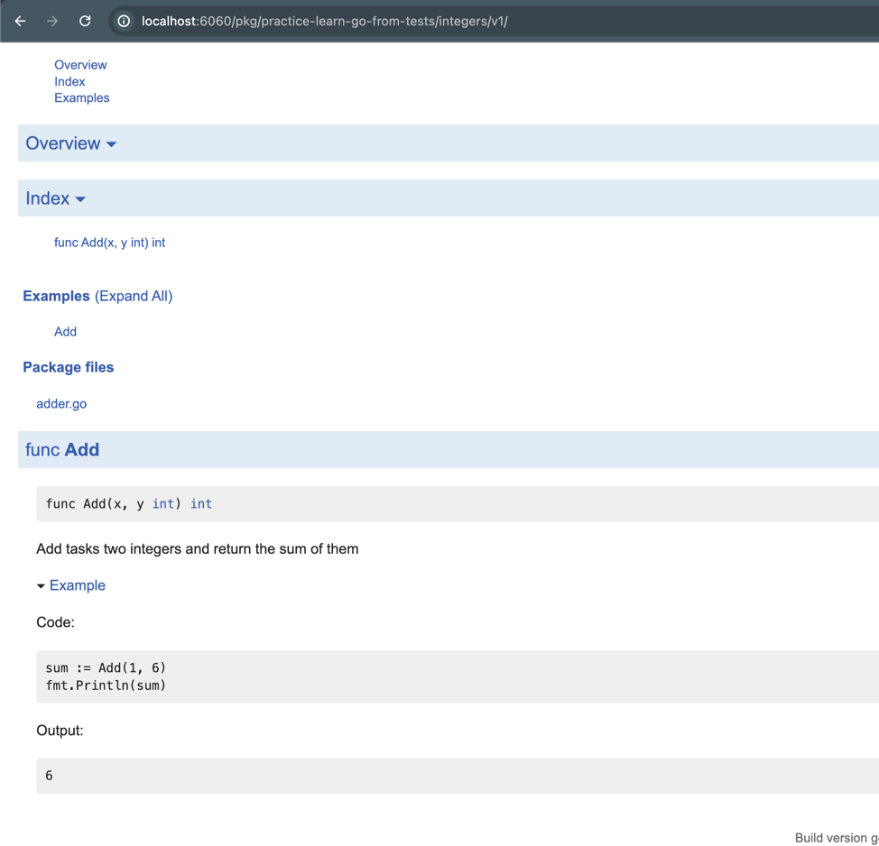

运行
```shell
godoc -http=:6060
```

然后在 `http://localhost:6060/pkg/` 里面，我看到我写的practice-learn-go-from-tests
里面的有我的包
```go
// Add tasks two integers and return the sum of them
func Add(x, y int) int {
	return x + y
}
```

这里里面上面的 //Add 后面的是这个方法的描述, 而在_test里面可以创建例子，
```go
func ExampleAdd() {
	sum := Add(1, 6)
	fmt.Println(sum)
	// Output: 6
}
```
他会在文档里面展示出来

然后测试可以用
```shell
go test -v
```
